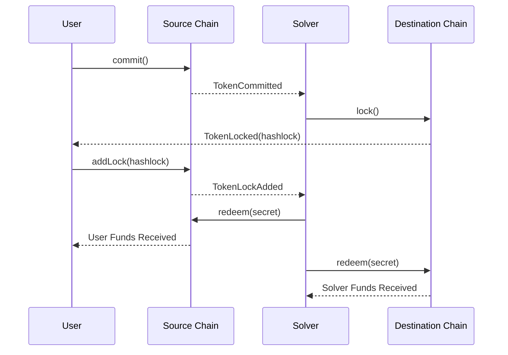

# Atomic Swaps with Local Verification

This proposal introduces a mechanism for achieving asset interoperability between Ethereum L2s and beyond using Atomic Swaps. The approach does not require a cross-chain messaging protocol, does not introduce new trust assumptions, and remains open and permissionless for any network to participate. It leverages an enhanced version of HTLCs (PreHTLC) in conjunction with recent advancements in local verification techniques, such as running a light client in the browser (e.g., Helios), to achieve two primary objectives:

- Trustless – Users should be able to transfer assets between chains without ever losing control of their funds.
- Permissionless – Networks should be able to join the protocol without approvals or gatekeepers.

## Intents with PreHTLC

PreHTLC introduces three key improvements over [traditional HTLCs](https://en.bitcoin.it/wiki/Hash_Time_Locked_Contracts):  

- Delegated secret management – The solver is responsible for managing secrets, reducing operational complexity for users.  
- Multiple solver selection – Users can designate multiple solvers to fulfill the transaction, mitigating the solver liveness risks.  
- Incentive alignment – A reward/slash mechanism ensures that solvers are economically incentivized to execute transactions promptly.  

This document does not exhaustively cover all [edge cases](https://docs.train.tech/protocol-spec/edge-cases) and [implementation details](https://docs.train.tech) but instead provides a high-level overview of the core process.

## Protocol Walkthrough

The following outlines the end-to-end execution when Alice transfers 1 ETH from Starknet to Optimism.  

### 1. Transaction initiation

- Alice accesses the Bridge dApp, connects her wallet, and selects the Starknet → Optimism transfer route.  
- The dApp queries the solver discovery contract to retrieve a list of available Solvers supporting the route.  
- Alice submits a commit transaction on Starknet, locking 1 ETH and specifying the set of Solvers.  

At this point, the locked funds are subject to one of two conditions:  

- A `Hashlock` is added once the auction winner is determined.  
- If no solver successfully acts on this transaction before the `Timelock` expires, Alice can reclaim her funds.  

### 2. Solver selection via Auction

- An auction is initiated, where Solvers (e.g., Bob and John) compete for the user's request.
- Bob wins the auction, generates a secret `S`, computes `Hashlock = HASH(S)`, and locks 1 ETH for Alice on Optimism.  

> The auction is completely off-chain, and its sole responsibility is to connect the user with the best solver. The user can skip this step by directly committing to an already known or preferred solver.

### 3. Local verification of the destination transaction

- The dApp performs local verification by monitoring Bob’s transaction on Optimism.  
- If a light client is available, it is utilized for validation. Otherwise, the dApp queries multiple RPC endpoints or a user-specified node.
- Upon confirming the transaction, the `Hashlock` is retrieved.

#### 3.1 Security considerations

The security of the exchange relies on this step, where the dApp retrieves the `Hashlock`. It is crucial to ensure that the `Hashlock` is correct. 

The worst-case scenario occurs when all of the following happen simultaneously:

- There is no light client for the destination network.
- Only a single RPC provider is available for that network.
- This single RPC provider is also the solver matched with the user.

Even in this case, the user still has the ability to manually verify the destination Hashlock and decide whether to proceed with the transaction.

### 4. Finalization

- Once `Hashlock` is verified, Alice signs a transaction that assigns the `Hashlock` to her previously committed funds and sets the `receiver` to Bob.  

At this stage, both chains (Starknet and Optimism) hold funds locked under the same `Hashlock`. The only remaining step is secret revelation.  

### 5. Secret disclosure and fund release

- Bob monitors Starknet for confirmation that the commitment is locked in his favor with the expected `Hashlock`.  
- Upon verification, Bob reveals the secret `S` on both chains, proving `HASH(S) = Hashlock`, thereby unlocking and claiming his funds while simultaneously releasing Alice's funds.  

## Standardization

The PreHTLC contracts are ownerless, immutable, and have no external dependencies. Their sole responsibility is to ensure that two parties can execute a trustless cross-chain swap. Other components—such as Auction, Discovery, dApp, and Solver—are complementary and can be customized or omitted entirely to suit different use cases.

## Conclusion

By integrating an intent/solver-based framework with PreHTLCs and local verification, this protocol achieves:  

- Sub-30-second (`2 x src_block_time + 2 x dst_block_time`) settlement times for cross-chain transfers.
- Neither Users’ nor Solvers’ funds are ever controlled by an intermediary.  
- Any blockchain network can be onboarded without requiring explicit permission.  

This approach ensures a scalable and trustless mechanism for cross-chain asset transfers without relying on third-party validators or external security mechanisms.
