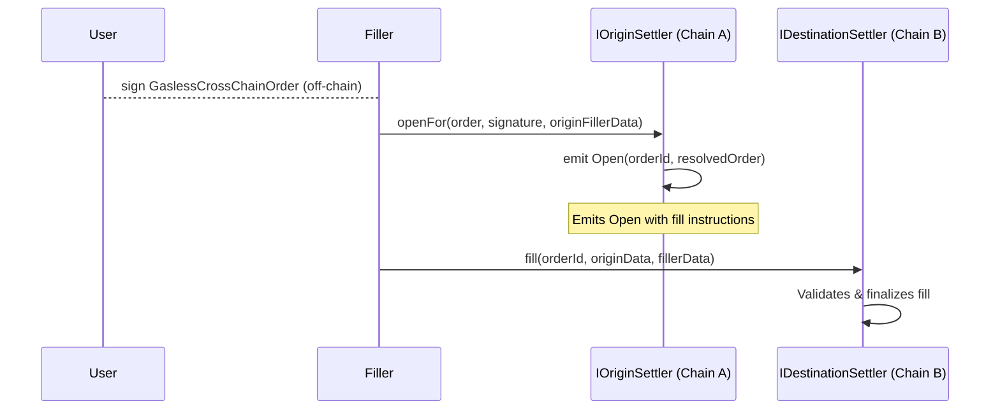
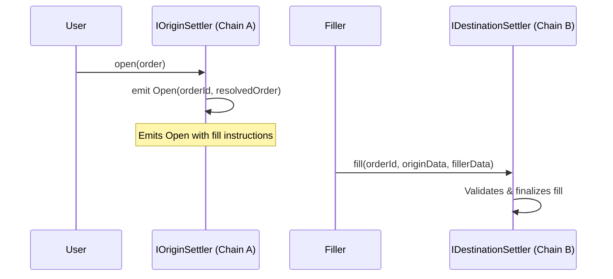
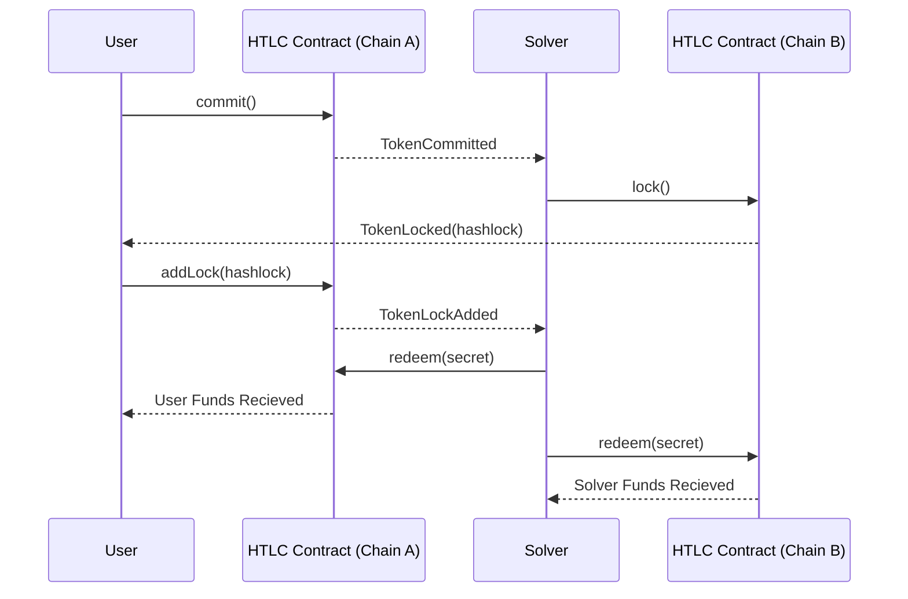

# Intents

It's called an intent to any user request that can be fulfilled by an agent in a fast manner. The user commonly "declares" what outcome they desire (e.g., fund transfer, token swaps) and it is allowed to be completed by solvers under given pricing, possibly in a competitive environment.

In interoperability, intents are key to enabling "cross-chain swaps," in which the user and solver (or underlying system) exchange assets in both origin and destination domains. This is particularly relevant in cases where users expect to initiate an action in one chain to be completed in another in a matter of seconds, in contrast to typical settlement wait times.

Intents are also considered a proper solution to minimize the consequences of liquidity fragmentation in a world where token representations are not homogeneous nor interconnected across chains.

## ERC-7683: Cross Chain Intents Standard

[ERC-7683](https://github.com/ethereum/ERCs/blob/master/ERCS/erc-7683.md) proposes a standard API for cross-chain value-transfer systems. A participant called a filler fulfills intents in the destination initiated by users and is paid out through a settlement system. Users are protected since their funds are escrowed in the origin chain and are released when the action is verified, commonly through a message passed and validated.

A CrossChainOrder is initiated (gasless or not gasless) and is resolved even when partitioned into several "legs". Note that the standard does not impose an opinion on the validation mechanism used to verify when an intent is completed.

For a gasless cross-chain Flow:

For an on-chain cross-chain flow:

This standard intentionally does not prescribe the specifics of final settlement logic or how cancellations like revoking an unfilled order should be handled. Implementations may choose to use any cross-chain messaging system.

## Intents with Atomic Swaps

[This proposal](atomic-swaps.md) introduces a mechanism for achieving asset interoperability between Ethereum L2s (and beyond) using Atomic Swaps. The approach does not require a cross-chain messaging protocol, does not introduce new trust assumptions, and remains open and permissionless for any network to participate.

This approach ensures a scalable and trustless mechanism for cross-chain asset transfers without relying on third-party validators or external security mechanisms.
