# Message Passing

As the Ethereum landscape evolves, passing valid messages between different L2s, L3s, and LXs becomes fundamental for interconnecting user activity across chains, moving liquidity, and unlocking multi-domain applications, among other reasons. The desire for standardized APIs has motivated the creation of various proposals, from simple interfaces to those that aim to accommodate recent (thus common) rollup flows.

## Existing Messaging Standards

These standards are meant to work between any blockchain. They are agnostic to how messages are verified or delivered, including any off-chain mechanisms.

### ERC-6170: Cross-Chain Messaging Interface

[ERC-6170](https://github.com/ethereum/ERCs/blob/master/ERCS/erc-6170.md/) defines a basic, minimal interface to send (`sendMessage`) and receive (`receiveMessage`) arbitrary messages. This is considered one of the most simple standards.

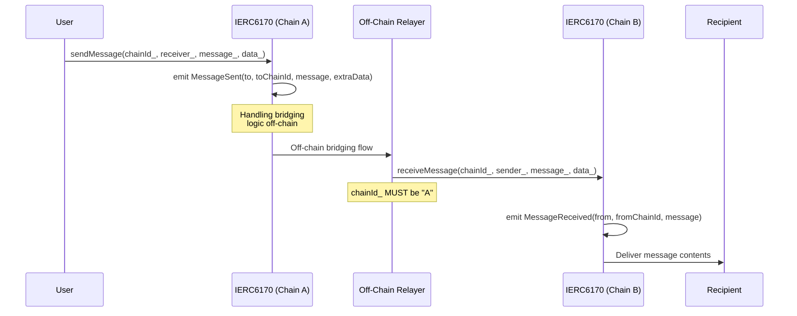

### ERC-7786: Cross-Chain Messaging Gateway

[ERC-7786](https://github.com/ethereum/ERCs/pull/673) also proposes a minimal interface to send (`sendMessage`) and receive (`executeMessage`) arbitrary messages. It contains extensible attributes that can be adapted to multiple bridging protocol models, as it is intented to be proof-agnostic. It leverages CAIP-10 for sender/receiver addresses, and introduces an optional post-proccessing step for any custom logic, as well as a explicit definitions of roles for sending and executing messages.

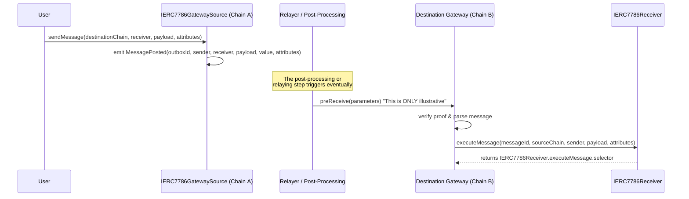

### ERC-7841: Cross-chain Message Format and Mailbox

[ERC-7841](https://github.com/ethereum/ERCs/pull/766), similarly to ERC-7786, defines a standard message format (metadata + payload). Also conceives the existence of the Mailbox contract for storing/retrieving messages, allowing either push- or pull-based bridging (see `execute` implementation example), so the message might sit "in the mailbox" until bridging is proven or invoked.

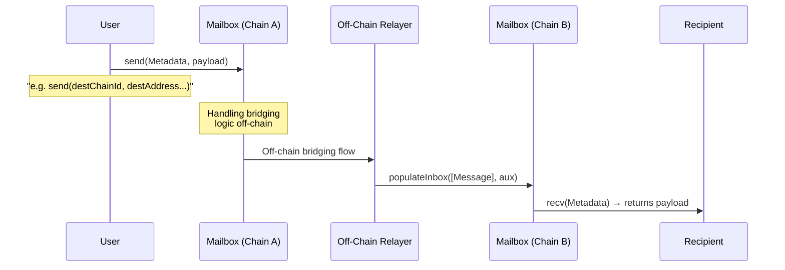

### ERC-7854: Verification-independent Cross-Chain Messaging

[ERC-7854](https://github.com/ethereum/ERCs/pull/817) defines a minimal interface that decouples the messaging functions from the underlying verification method. Introduces a "Interchain Security Modules" API as a way to isolate the verification of messages.

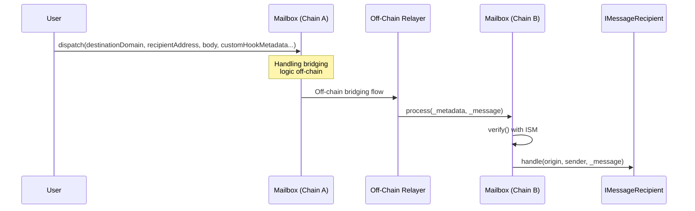

## External Messaging Protocols

Different protocols have been built to enable message passing across the chains they support. In principle, all of them function with their own security models and operate independently of the chains’ operations and governance. Most prioritize speed over canonical bridges, as they rely on some degree of confirmation subjectivity.

Note that actual implementations may choose to adopt existing standards or define their own interfaces.

### CCTP

[CCTP](https://developers.circle.com/stablecoins/cctp-getting-started) is a cross-chain protocol for transferring USDC between supported chains. It deploys the respective messenger contracts, where messages (burn and then mint) are orchestrated.

- **V1**: Establishes the `MessageTransmitter` by defining `sendMessage`, with destination, recipient, and `messageBody`, as well as the `receiveMessage` function. Users are able to self-relay. Senders can specify who is allowed to relay by using `sendMessageWithCaller`. Messages can be replaced before being received using `replaceMessage`.

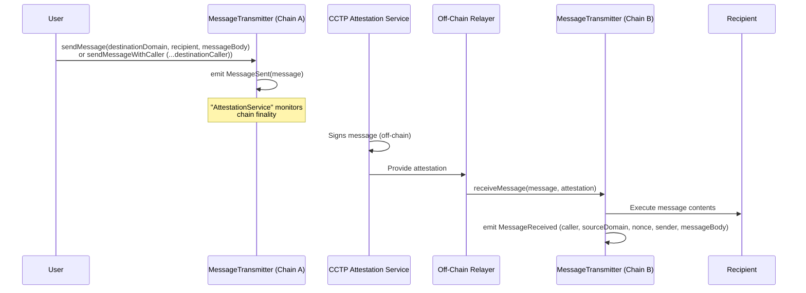

- **V2**: `MessageTransmitterV2` defines `sendMessage` similarly to V1, but adds `destinationCaller` as a default parameter and includes `finalityThresholdExecuted`. The `receiveMessage` function is adapted to support these new features. A `replace` function, as seen in V1, is not explicitly present in this version.

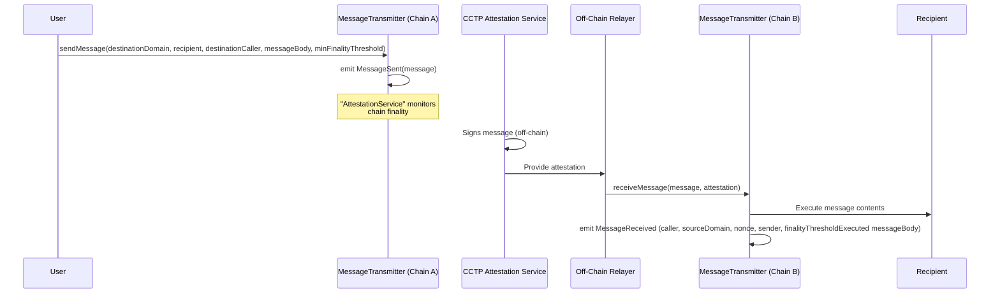

### LayerZero

[LayerZero](https://docs.layerzero.network/v2/developers/evm/technical-reference/api) is a generic messaging protocol that deploys an `EndpointV2` on each chain. Users invoke `send` on the source endpoint, optionally paying fees in either native tokens or the `lzToken`. Off-chain relayers verify and transport the message to the destination chain, where the `verify` (under validation flow) and `lzReceive` calls deliver the payload to the intended receiver contract. Additional features include allowing delegated calls, clearing queued messages with `clear`, and customizing fee payments or message parameters via `MessagingParams`.

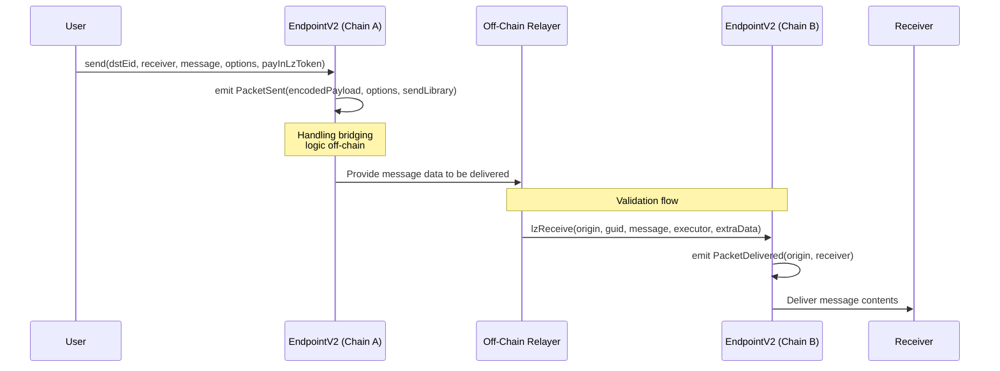

## Rollup Messaging Protocols

Some implement their own messaging protocols to interoperate with specific instances they choose and may also rely on.

### Linea

[Linea](https://docs.linea.build/technology/message-service) deploys the corresponding messenger contracts on both L1 and L2. The relayers (called Postbots) listen for calls made on either side and deliver them to the destination. All cross-chain messages pass through this service, which provides replay protection.

The `sendMessage` function includes the value, recipient, fee to pay, and calldata, while `claimMessage` adds the fee recipient and nonce on top of those. Manual claiming is always available, especially used when no fee is set to be paid. For both flows, messages must first be verified against `MessageManager`. Additionally, for L2→L1 transfers, `claimMessageWithProof` is used, which includes a Merkle proof for final verification.

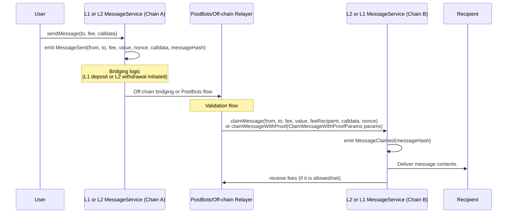

### OP Stack

OP Stack deploys corresponding messenger contracts on both L1 and L2, as well as L2-to-L2 when interoperability is enabled at the protocol level. All of them include replay protection.

- **[L1→L2 / L2→L1](https://specs.optimism.io/protocol/messengers.html)**: This follows the `CrossDomainMessenger` library. The `sendMessage` function includes the target, value (in ETH), message data, and gas limit. The `relayMessage` function, in turn, includes the same parameters while adding the sender and nonce.
    - L1→L2 operates on a push-based model, where sequencers process deposits when deemed safe, strictly following the order in which they were initiated.
    - L2→L1 follows a pull-based model, where withdrawals are finalized asynchronously in practice, and executed through `finalizeWithdrawalTransaction`.

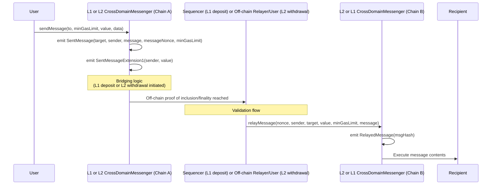
- **[L2→L2](https://specs.optimism.io/interop/messaging.html)**: This has its own flow while still relying on the `sendMessage` and `relayMessage` concepts. Messages are sent directly from one L2 chain to another by specifying the destination chain ID, the target address, and the message payload. Once the message is validated via `CrossL2Inbox`, anyone can call `relayMessage` on the destination L2 by providing proof of the source event. This process remains asynchronous and can be finalized as soon as possible, depending on off-chain relayers and sequencers detecting and confirming initiated messages.

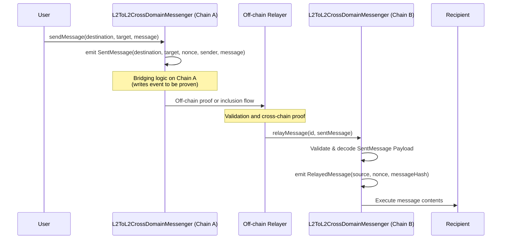

### Scroll

[Scroll](https://docs.scroll.io/en/developers/l1-and-l2-bridging/the-scroll-messenger/) deploys messenger contracts on both L1 and L2. Cross-chain messages always go through these messengers, which provide replay protection.

The L1→L2 / L2→L1 flow follows the `ScrollMessengerBase` library. The `sendMessage` function includes the target, value (in ETH), message data, and gas limit. Both implementations define two `sendMessage` functions (one of them includes `refundAddress`; perhaps the refund mechanism is not actually implemented for withdrawals). The `relayMessage` function, in turn, includes the same parameters while also adding the sender and nonce.

- L1→L2 operates on a push-based model, where sequencers process deposits after they are included in the queue. The L1 contract also contains the `replayMessage` function, responsible for retrying or updating the gas for previously sent but skipped messages, and `dropMessage`, which allows the cancellation of a never-included message and the reclaiming of locked value.
- L2→L1 follows a pull-based model, where messages are finalized asynchronously. Messages are finalized by calling `relayMessageWithProof`, which requires a Merkle Proof.

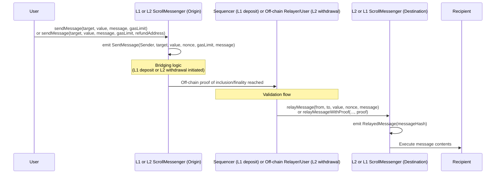

# Comparison

The existing approaches are divided into proposed standards and actual implementations. While standards aim to be agnostic and broad to cover a wide range of use cases, actual implementations serve as references for what is included and how it is implemented.

| **Standard (or protocol)** | **ERC-6170** | **ERC-7786** | **ERC-7841** | **ERC-7854** | **CCTP V1** | **CCTP V2** | **LayerZero** | **OP Stack L1/L2** | **OP Stack L2/L2** | **Linea** | **Scroll** |
| --- | --- | --- | --- | --- | --- | --- | --- | --- | --- | --- | --- |
| **What is it? (*Status*)** | Standard (Draft, merged on Dec 25, 2022) | Standard (Draft, merged on Dec 4, 2024) | Standard (Draft, open) | Standard (Draft, open) | Protocol (Implemented) | Protocol (Implemented) | Protocol (Implemented) | Protocol (Implemented) | Protocol (Devnet) | Protocol (Implemented) | Protocol (Implemented) |
| **Motivation / Main Use Case** | Interface for message-passing | Interface for message-passing | Interface for Interface for message-passing, focused for L2s. | Interface for message-passing, focused on Ethereum ecosystem. | Message Layer for USDC cross-chain transfers. | Message Layer for USDC cross-chain transfers. | Message Layer for any cross-chain use cases. | Message Layer leveraged from underlying rollup security model. | Message Layer leveraged from underlying rollup security model. | Message Layer leveraged from underlying rollup security model. | Message Layer leveraged from underlying rollup security model. |
| **VM Compatibility** | Intended to be agnostic. Usage of `bytes`  | Intended to be agnostic. It uses CAIP for this purpose. | It includes a rationale on how to adapt it to virtual machines other than the EVM.| Intended to be agnostic. ISMs are modular and extensible | Multiple VMs. | Multiple VMs. | Multiple VMs. | - | - | - | - |
| **Chain ID Format** | Custom `bytes`. Proposes each chain have a unique byte string ID (e.g. encode “ETH” or “ARB”.) | CAIP-2 (via CAIP-10). Used as `string` (e.g., `"eip155:1"` for Ethereum mainnet). This avoids relying on numeric IDs like EIP-155 exclusively. | Custom `uint32`. Expected to be EIP-155 or context-based. | Custom `uint32`. Expected to be EIP-155 or context-based. | Custom `uint32` chain identifiers called *domains*. | Custom `uint32` chain identifiers called *Endpoint IDs*. | Custom `uint32` chain identifiers defined as *Endpoint IDs*. | Not included, since it is implicit. | `uint256` to be EIP-155 based. | Not included, since it is implicit. | Not included, since it is implicit. |
| **Main Entry Functions** | `sendMessage` and `receiveMessage`. | `sendMessage` via gateway, `executeMessage` on receiver. | `populateInbox()` and `recv()` on `Mailbox`. | `dispatch` and `process` on `Mailbox`, `handle` on recipient. | `sendMessage` and `receiveMessage`.. | `sendMessage` and `receiveMessage`. | `send` and `lzReceive`.  | `sendMessage` and `relayMessage`. | `sendMessage` and `relayMessage`. | `sendMessage` and `claimMessage`. | `sendMessage` and `relayMessage`. |
| **Event Emissions** | `MessageSent`/`MessageReceived` | `MessagePosted` | Not defined | Not defined | `MessageSent`/`MessageReceived` | `MessageSent`/`MessageReceived`  | `PacketSent`/`PacketDelivered` | `SentMessage`/`RelayedMessage`  | `SentMessage`/`RelayedMessage` | `MessageSent`/`MessageClaimed`  | `SentMessage`/`RelayedMessage` |
| **Extra Data Format** | Through raw `bytes`. | In `bytes[] attributes`. Extensible (e.g. custom bridging or gas instructions). | Via struct: `{ Message metadata, payload }`. | Via struct: `Message { version, nonce, origin, sender, destination, recipient, body }` | Through raw `bytes`. | Through raw `bytes`. | Payload + adapter params in `bytes`. No standard format, user-defined. | Through raw `bytes`. | Through raw `bytes`. | Through raw `bytes`. | Through raw `bytes`. |
| **Message Validation/Safety** | Not addressed but pluggable. | Not addressed but pluggable. | Done before `recv` through relayer’s input in `populateInbox` via `aux` field or another source. | Defined via an ISM contract. | Attestation provided by Circle, used as an input during `receiveMessage`. | Attestation provided by Circle, used as an input during `receiveMessage`. | verify function is contained in the same contract, authenticated. | L1→L2: Validated by consensus. L2→L1: Validated by the proof system, authenticated. | Validated by consensus, authenticated. | L1→L2: Validated by consensus. L2→L1: Validated by the proof system. | L1→L2: Validated by consensus. L2→L1: Validated by the proof system. |
| **Message Retries, Cancellations, Replacement or Claimback** | Not defined. | Not defined. | Not defined. Separate verification method might allow it. | Not defined. ISM might allow it. | Messages can be replaced. This is done as a separate implementation on top of `sendMessage`. | Not defined. | Messages can be retried. Also they might be erased in destination by calling a separate `clear` function. | Messages can be retried. | No explicit mechanisms. | No explicit mechanisms. | Messages can be claimed back if they are not picked to process in destination. |
| **Gas/Fee Handling** | None built-in. Payable function + `data_` field can hold fee info. | Payable. `value` in event used for fees, plus flexible `attributes`. There is a value field. | None built-in. | Fee mechanism via its post-dispatch hooks (e.g. through `INTERCHAIN_GAS_PAYMASTER`) and add a quote function. | No fees. | No direct fees but hooks can include a payment logic. | Fee pay out in origin in `send`. | Deposits include L2 gas. Withdrawals cost are covered by who call `relayMessage`. | Not defined. | User may leave a tip, optional. | Deposits include L2 gas. Withdrawals cost are covered by who call `relayMessage`. |
| **Bundling** | Single message. | Single message, but attributes can define some bundling logic. | `sessionId` can group messages. No atomic multi-call. | Yes, possible bundling through ISM validation to orchestrate it. | No bundling. | Yes, limited to “mint + 1 contract call”. | Single message, but attributes can define some bundling logic. `guid`/`compose`can coordinate multiple packets. | Single call invocation. | Single call invocation. | Single call invocation. | Single call invocation. |
| **Pull/Push Support** | Not defined (but it could given its generality) | Explicitly supports both. | Supported via separate mailbox contracts | Supported; e.g. integration with synchronous L2s like Superchain outlined. | Support both. | Support both. | Support both. | Push in deposits. Pull in withdrawals. | Support both. | Push in deposits. Pull still available. Pull in withdrawals. | Push in deposits. Pull in withdrawals. |
| **Modularity** | Simple Interface. | Gateway + attributes give modularity open to implementers. | Modular: mailbox split by sync/async, attributes via metadata, inbox logic separate. | Highly modular: ISMs, Hooks, message structure, full plug-and-play components | Implementation attached to their use cases. | Implementation attached to their use cases. | Modular since it has core + pluggable Send/Receive libraries, DVN & Executor choice, composer for follow‑ups, all under the LayerZero definitions. | Mostly monolithic. | Mostly monolithic. | Mostly monolithic. | Mostly monolithic. |
