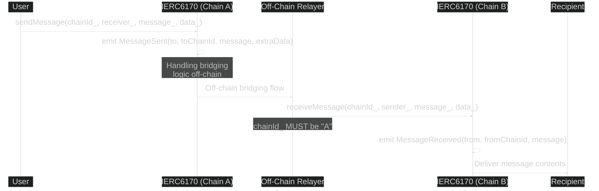
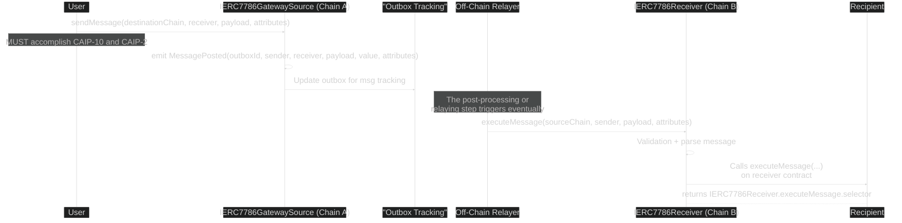
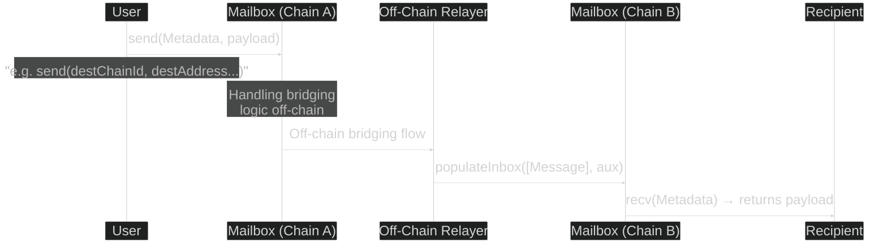
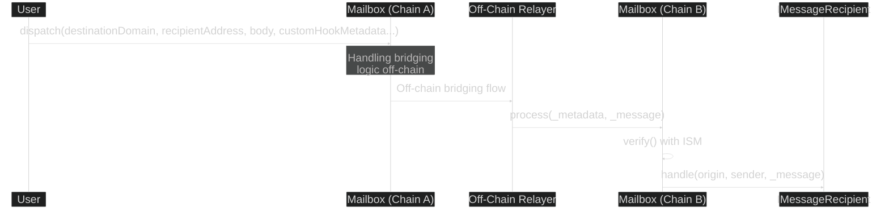
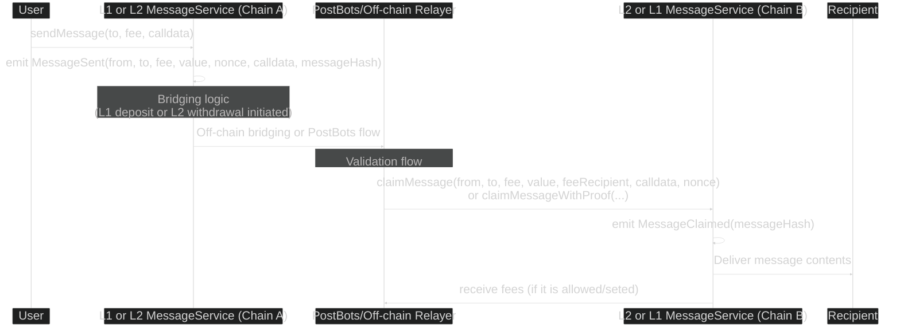
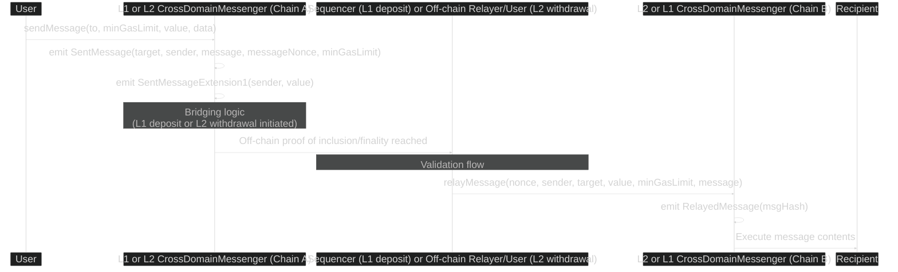
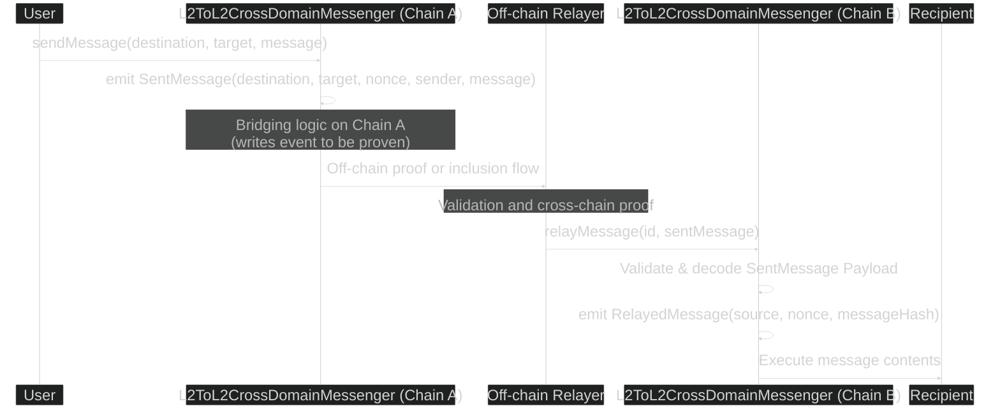

# Message Passing

As the Ethereum landscape evolves, passing valid messages between different L2s, L3s, and LXs becomes fundamental for interconnecting user activity across chains, moving liquidity, and unlocking multi-domain applications, among other reasons. The desire for standardized APIs has motivated the creation of various proposals, from simple interfaces to those that aim to accommodate recent (thus common) rollup flows.

## Existing Messaging Standards

Standards are made to fit from any blockchain to potentially any blockchain. These standards are not concerned with the verification mechanism or off-chain methods of a message to verify and deliver.

### ERC-6170: Cross-Chain Messaging Interface

[ERC-6170](https://github.com/ethereum/ERCs/blob/master/ERCS/erc-6170.md/) defines a basic, minimal interface to send (`sendMessage`) and receive (`receiveMessage`) arbitrary messages. This is considered one of the most simple standards.

### ERC-7786: Cross-Chain Messaging Gateway

[ERC-7786](https://github.com/ethereum/ERCs/pull/673) also proposes a minimal interface to send (`sendMessage`) and receive (`executeMessage`) arbitrary messages. It containts extensible attributes that can be adapted to multiple bridging protocol models, as it is intented to be proof-agnostic. It leverages CAIP-10 for sender/receiver addresses, and introduces an optional post-proccessing step for any custom logic, as well as a explicit definitions of roles for sending and executing messages.

### ERC-7841: Cross-chain Message Format and Mailbox

[ERC-7841](https://github.com/ethereum/ERCs/pull/766), similarly to ERC-7786, defines a standard message format (metadata + payload). Also conceives the existence of the Mailbox contract for storing/retrieving messages, allowing either push- or pull-based bridging (see `execute` implementation example), so the message might sit "in the mailbox" until bridging is proven or invoked.

### ERC-7854: Verification-independent Cross-Chain Messaging

[ERC-7854](https://github.com/ethereum/ERCs/pull/817) defines a minimal interface that decouples the messaging functions from the underlying verification method. Introduces a "Interchain Security Modules" API as a way to isolate the verification of messages.

## Rollup Messaging Protocols

Most rollups have built-in messaging interfaces between L1 and L2. 

### Linea

Linea deploys the corresponding messenger contracts on both L1 and L2. The relayers (called Postbots) listen for calls made on either side and deliver them to the destination. All cross-chain messages pass through this service, which provides replay protection.

The `sendMessage` function includes the value, recipient, fee to pay, and calldata, while `claimMessage` adds the fee recipient and nonce on top of those. Manual claiming is always available, especially used when no fee is set to be paid. For both flows, messages must first be verified against `MessageManager`. Additionally, for L2→L1 transfers, `claimMessageWithProof` is used, which includes a Merkle proof for final verification.

### OP Stack

OP Stack deploys corresponding messenger contracts on both L1 and L2, as well as L2-to-L2 when interoperability is enabled at the protocol level. All of them include replay protection.

- **L1→L2 / L2→L1**: This follows the `CrossDomainMessenger` library. The `sendMessage` function includes the target, value (in ETH), message data, and gas limit. The `relayMessage` function, in turn, includes the same parameters while adding the sender and nocce.
    - L1→L2 operates on a push-based model, where sequencers process deposits when deemed safe, strictly following the order in which they were initiated.
    - L2→L1 follows a pull-based model, where withdrawals are in practice finalized asynchronously.

- **L2→L2**: This has its own flow while still relying on the `sendMessage` and `relayMessage` concepts. Messages are sent directly from one L2 chain to another by specifying the destination chain ID, the target address, and the message payload. Once the message is validated via `CrossL2Inbox`, anyone can call `relayMessage` on the destination L2 by providing proof of the source event. This process remains asynchronous and can be finalized as soon as possible, depending on off-chain relayers and sequencers detecting and confirming initiated messages.

# Comparison

[WIP]
