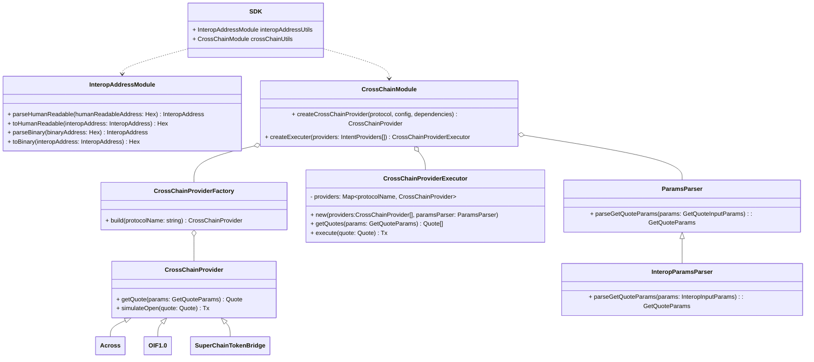
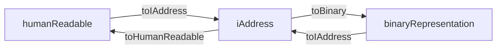
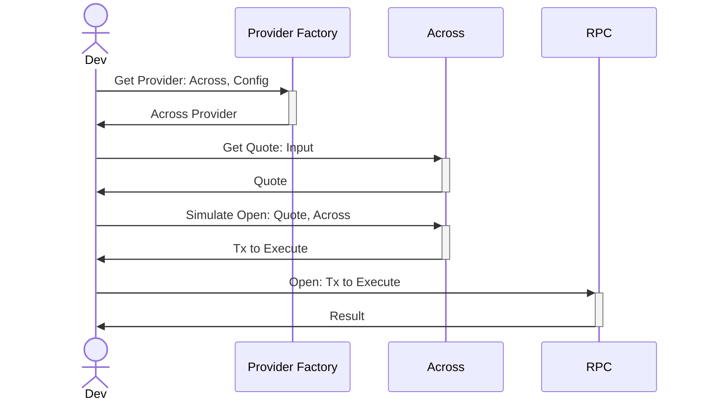
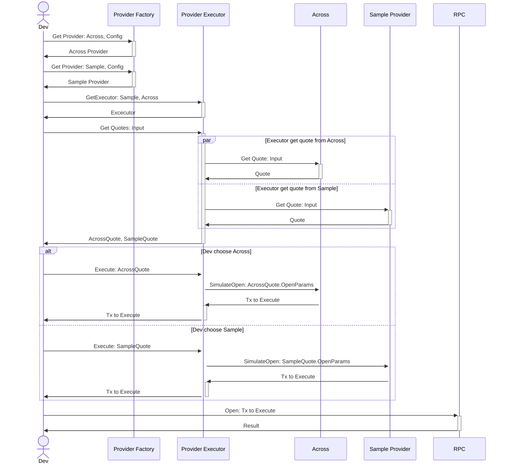
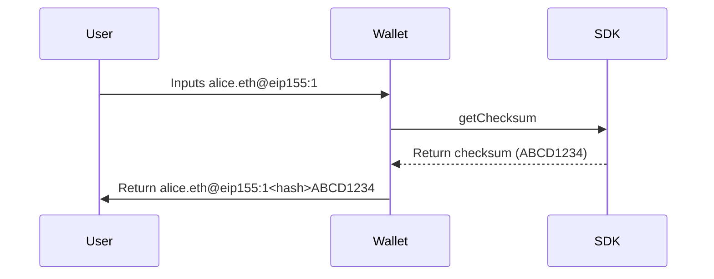
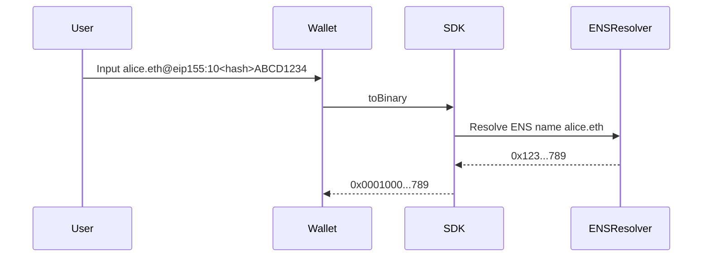
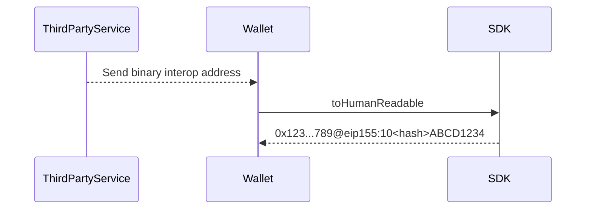
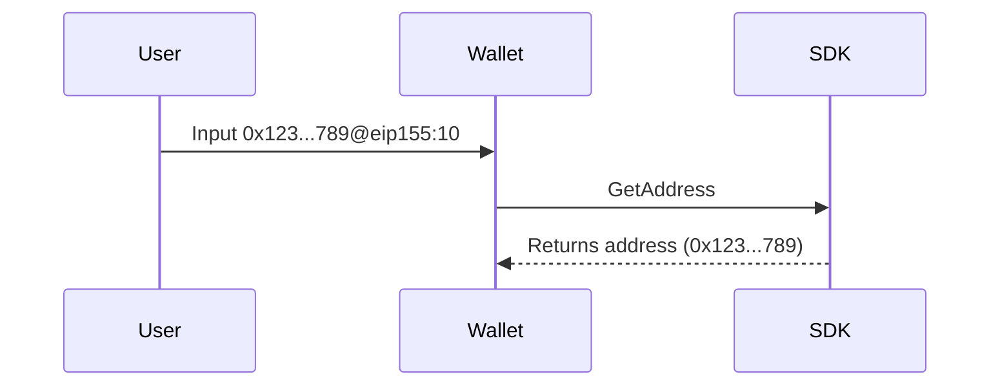
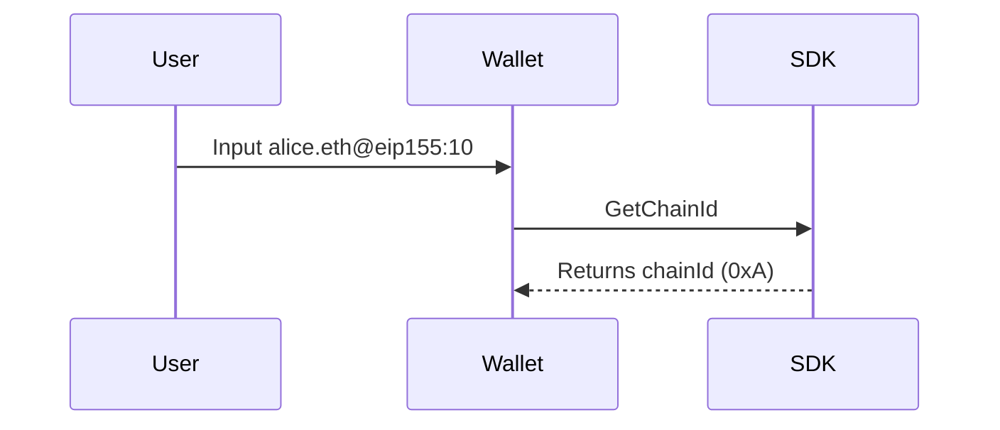

# Interop SDK Tech Design

# Introduction

As part of the **Driving Interop** initiative, our goal is to reduce fragmentation across Ethereum chains by introducing a standard for interoperable addresses and enabling intents-based cross-chain interactions. To support this effort, we present the **Interop TypeScript SDK**, a modular and developer-friendly toolkit designed to simplify integration of interoperability primitives into decentralized applications.

This SDK enables:

- **Decoding** of human-readable interoperable addresses into binary format, following the [ERC-7930](https://ethereum-magicians.org/t/erc-7930-interoperable-addresses/23365) standard.
- **Encoding** of interoperable addresses into UX-friendly formats suitable for frontend display.
- **ENS resolution** support to allow interoperable addresses to include human-readable names.
- **CrossChain** support enabling users to get quotes and submit intents across open-intent protocols on EVM chains.

The technical design document that follows will outline the structure of the SDK, its core components, and how developers can leverage it to enhance cross-chain compatibility in their solutions.



 

# In-Depth

## Interoperable Addresses

ERC-7390 introduces a new binary address format, the interoperable address (iAddress), which includes both a chain identifier and an account identifier.

Our SDK is designed to implement functionalities related to the usage of these new iAddress, including

- Serialize an iAddress into its binary representation ([ERC-7930](https://ethereum-magicians.org/t/erc-7930-interoperable-addresses/23365))
- Parse a human readable address into an iAddress, [ERC-7828](https://ethereum-magicians.org/t/erc-7828-chain-specific-addresses-using-ens/21930) compatible
- Serialize a human readable address into its binary representation



This SDK is expected to implement all human-to-binary conversion paths to provide users with a complete set of functionalities.

### The `InteropAddress` type

We introduce a new type, the `InteropAddress` that will work as primary representation of an interop address on the SDK

```tsx
// Interop Address type definition
export type InteropAddress = {
    version: number;
    chainType: Uint8Array;
    chainReference: Uint8Array;
    address: Uint8Array;
};
```

Using `Uint8Array` instead of `string` for the fields in the `InteropAddress` type ensures that the data is represented in a raw, unambiguous binary format. This provides several advantages:

- **Precision**: `Uint8Array` accurately represents each byte of data, avoiding any misinterpretation or alteration that might happen with character encodings in strings (e.g., UTF-8, UTF-16).
- **Efficiency**: Binary data is more compact and faster to process than encoded string representations, especially in environments where performance and minimal overhead are critical.
- **Interoperability**: `Uint8Array` ensures better compatibility with encoding and decoding libraries, which is important since different chains may use different encoding standards.
- **Security**: Handling addresses and identifiers as raw bytes reduces the surface area for encoding-related vulnerabilities or errors when interfacing with blockchain systems or binary serialization formats.

### The `InteropAddressFields` type

```tsx
export type interopAddressFields = {
	version: number;
	chainType: string // CAIP-2 namespace
	chainReference: string, // chain reference
	address: Address | `0x${string}` // chain specific account id
}
```

Similar to `InteropAddress` type we have the `InteropAddressFields` which is a more readable representation of the `InteropAddress`

## Human Readable Addresses

We want to support as many different human readable addresses as posible without compromising the 1:1 relation with its binary representation.

Supported address format should include:

- ENS + Chain list (only evm compatible chains): `gori.eth@eth` , `gori.eth@oeth`
- Raw Address + CAIP-2: `0xd8dA6BF26964aF9D7eEd9e03E53415D37aA96045@eip155:1`
- ENS + CAIP-2: `gori.eth@eip155:1`
- Full Base64 interoperable address.

[Human Readable Address Test Suite](https://www.notion.so/Human-Readable-Address-Test-Suite-1df9a4c092c780be8e47cfbfe6531184?pvs=21)

### Valid ENS names

ENS names must conform to the following syntax:

```bash
<domain> ::= <label> | <domain> "." <label>
<label> ::= any valid string label per [UTS46](https://unicode.org/reports/tr46/)
```

The [IDNA mapping table](https://www.unicode.org/Public/idna/latest/) describes the full list of unicode characters and its UTS46 mapping with the **UseSTD3ASCIIRules** flag activated thus

> These rules exclude ASCII characters outside the set consisting of A-Z, a-z, 0-9, and U+002D ( - ) HYPHEN-MINUS
> 

Therefore, an ENS name must not include an '@' character, making it safe to split on '@'.

- [idna-uts46](https://www.npmjs.com/package/idna-uts46) library implements the UTS-46 specification
    
    ```jsx
    import uts46 from 'idna-uts46';
    
    export function isValidEnsName(address) {
      try {
        uts46.toAscii(
          address,
          {
            transitional: false,
          useStd3ASCII: true,
        }
      );
      return true;
      } catch (error) {
        return false;
      }
    }
    
    console.log(isValidEnsName('vitalik.eth')); // true
    console.log(isValidEnsName('vita@lik.eth')); // false
    ```
    

## CrossChain Framework

We want to implement a framework to interact with different protocols(providers) which allow us to manage cross chain transactions.

### Providers

- **Open Intents Framework [**[OIF](https://www.openintents.xyz/)**]**

An **intent** is a user’s *declaration of desired outcome, for example “I want to bridge X tokens from chain A for at least Y tokens in chain B.”*

The Open Intents Framework is a public good initiative led by contributors from the EF, [Hyperlane](https://hyperlane.xyz/) and [Bootnode](https://www.bootnode.dev/) with the goal of bringing open and permissionless intents to all of Ethereum.

### Methods

Two methods defined for interactions with providers

- **GetQuote(input, protocol): Quote**

`GetQuote` will obtain a posible quote which fulfill the input entered by the dev in the specified protocol.

- **SimulateOpen(Quote): void**

`SimulateOpen` will return a transaction to execute the quote returned by the `GetQuote` function

### Interfaces

We will define some interfaces to GetQuote method

```tsx
export interface Input {
	/// @dev The contract address of the source token on the origin chain
	inputToken: string,
	/// @dev The contract address of the destination token on the destination chain
	outputToken: string,
	/// @dev Chain id of the origin chain
	inputChainId: string,
	/// @dev Chain id of the destination chain
	outputChainId: string,
	/// @dev Amount of input token to move
	inputAmount: string
}

export interface Quote {
	/// The protocol used to get q
	protocol: string,
	/// The contract address of the source token on the origin chain
	inputToken: string,
	/// The contract address of the destination token on the destination chain
	outputToken: string,
	/// Chain id of the origin chain
	inputChainId: string,
	/// Chain id of the destination chain
	outputChainId: string,
	/// Amount of input token to move
	inputAmount: string
	/// Amount of output token the user will receive
	outputAmount: string
	/// Fee Amount
	fee: string
	/// Object OIF ready to pass to open or simulateOpen method
	/// Folow Open Inten Framework standard
	oifParams: {
		fillDeadline: uint32;
		orderDataType: uint32Array;
		orderData: uint8Array;
	}
}

function getQuote(input: Input, options: {protocol: Protocols}): Quote
function simulateOpen(quote: Quote): TxToExecute
```

### Flow

**Simple Flow using Provider Directly**



**Advance Flow using Executor**



# API

## Interoperable Addresses

### **build(interopAddressFields) : InteropAddress**

This method constructs a interop address based on the received params

```tsx
// build example
const interopAddressFields = {
	version: 1, // future versions of the interop address may change this param
	chainType: "eip155" // CAIP-2 namespace
	chainReference: "1", // chain reference
	address: "0xd8dA6BF26964aF9D7eEd9e03E53415D37aA96045" // chain specific account id
}
build(interopAddressFields)
/* {
	version: 1,
	chainType: Uint8Array([0,0]),
	chainReference: Uint8Array([1]),
	address: Unit8Array([
	  216, 218, 107, 242, 105, 100,
	  175, 157, 126, 237, 158,   3,
	  229,  52,  21, 211, 122, 169,
	   96,  69
	])
} */
```

### **parseBinary(BinaryAddress) : InteropAddress**

Takes a binary address and returns an interopAddress

```tsx
// parseBinary example
const binaryAddress: BinaryAddress = "0x00010000010114D8DA6BF26964AF9D7EED9E03E53415D37AA96045"
parseBinary(binaryAddress)
/* {
	version: 1,
	chainType: Uint8Array([0,0]),
	chainReference: Uint8Array([1]),
	address: Unit8Array([
	  216, 218, 107, 242, 105, 100,
	  175, 157, 126, 237, 158,   3,
	  229,  52,  21, 211, 122, 169,
	   96,  69
	])
} */
```

### **toBinary(InteropAddress) : BinaryAddress**

Takes an interop address and returns a binary representation

```tsx
// toBinary example
const interopAddress = {
	version: 1,
	chainType: Uint8Array([0,0]),
	chainReference: Uint8Array([1]),
	address: Unit8Array([
	  216, 218, 107, 242, 105, 100,
	  175, 157, 126, 237, 158,   3,
	  229,  52,  21, 211, 122, 169,
	   96,  69
	])
}
toBinary(interopAddress)
/*
0x00010000010114D8DA6BF26964AF9D7EED9E03E53415D37AA96045
  ^^^^-------------------------------------------------- Version:              decimal 1
      ^^^^---------------------------------------------- ChainType:            2 bytes of CAIP namespace
          ^^-------------------------------------------- ChainReferenceLength: decimal 1
            ^^------------------------------------------ ChainReference:       1 byte to store uint8(1)
              ^^---------------------------------------- AddressLength:        decimal 20
                ^^^^^^^^^^^^^^^^^^^^^^^^^^^^^^^^^^^^^^^^ Address:              20 bytes of ethereum address
*/
```

### **parseHumanReadable(HumanReadableAddress) : InteropAddress**

Takes a human-readable address and returns an `InteropAddress`. This function also handles ENS name resolution if necessary.

```tsx
// parseHumanReadable example
const humanReadableAddress = "0xd8dA6BF26964aF9D7eEd9e03E53415D37aA96045@eip155:1#4CA88C9C"
parseHumanReadable(humanReadableAddress)
/* {
	version: 1,
	chainType: Uint8Array([0,0]),
	chainReference: Uint8Array([1]),
	address: Unit8Array([
	  216, 218, 107, 242, 105, 100,
	  175, 157, 126, 237, 158,   3,
	  229,  52,  21, 211, 122, 169,
	   96,  69
	])
} */
```

### **toHumanReadable(interopAddress) : HumanReadableAddress**

Takes an InteropAddress and returns a human readable address

```tsx
// toHumanReadable example
const interopAddress = {
	version: 1,
	chainType: Uint8Array([0,0]),
	chainReference: Uint8Array([1]),
	address: Unit8Array([
	  216, 218, 107, 242, 105, 100,
	  175, 157, 126, 237, 158,   3,
	  229,  52,  21, 211, 122, 169,
	   96,  69
	])
}
toHumanReadable(interopAddress)
// 0xd8dA6BF26964aF9D7eEd9e03E53415D37aA96045@eip155:1#4CA88C9C
```

### **getChainId(interopAddress) : Hex**

Takes an interopAddress and returns the chainId, hex encoded. This should be used by the user to call contracts that do not support interop addresses.

```tsx
// getChainId example
const interopAddress = {
	version: 1,
	chainType: Uint8Array([0,0]),
	chainReference: Uint8Array([1]),
	address: Unit8Array([
	  216, 218, 107, 242, 105, 100,
	  175, 157, 126, 237, 158,   3,
	  229,  52,  21, 211, 122, 169,
	   96,  69
	])
}
getChainId(interopAddress)
// 0x1
```

### **getAddress(interopAddress) : Hex**

Takes an interopAddress and returns the hex encoded address string. This should be used by the user to call contracts that do not support interop addresses.

```tsx
// getAddress example
const interopAddress = {
	version: 1,
	chainType: Uint8Array([0,0]),
	chainReference: Uint8Array([1]),
	address: Unit8Array([
	  216, 218, 107, 242, 105, 100,
	  175, 157, 126, 237, 158,   3,
	  229,  52,  21, 211, 122, 169,
	   96,  69
	])
}
getAddress(interopAddress)
// 0xd8dA6BF26964aF9D7eEd9e03E53415D37aA96045
```

### getQuote(input, options): Quote

Get available quotes to deposit 100 USDC in optimism and receive USDC in arbitrum, using across

```tsx
const input = {
	inputToken: "0x0b2c639c533813f4aa9d7837caf62653d097ff85" // USDC in Optimism
	outputToken: "0xaf88d065e77c8cc2239327c5edb3a432268e5831" // USDC in Arbitrum
	inputChainId: "10"
	outputChainId: "42161"
	inputAmount: "100"
}

const options = {
	protocol: "across"
}

getQuote(input, options)
/**
	* Quote
	  {
	    inputToken: "0x0b2c639c533813f4aa9d7837caf62653d097ff85" // USDC in Optimism
			outputToken: "0xaf88d065e77c8cc2239327c5edb3a432268e5831" // USDC in Arbitrum
			inputChainId: "10"
			outputChainId: "42161"
			inputAmount: "100"
			outputAmount: "98"
			fee: "2"
			oifParams: 
				{
				  fillDeadline: 152452345;
					orderDataType: 324234234234;
					orderData: [234, 24, 24, 52];
			  }
		}
*/
```

### simulateOpen(quote): Tx

When user want to execute the obtained quote, he will execute simulateOpen using the quote received, this will return a Tx ready to sign and send to the RPC

```tsx
const input = {
	inputToken: "0x0b2c639c533813f4aa9d7837caf62653d097ff85" // USDC in Optimism
	outputToken: "0xaf88d065e77c8cc2239327c5edb3a432268e5831" // USDC in Arbitrum
	inputChainId: "10"
	outputChainId: "42161"
	inputAmount: "100"
};

const options = {
	protocol: "across"
};

const quote = await getQuote(input, options);

simulateOpen(quote);
```

# User stories

## Interop Addresses

**US1: Get checksum for a manually inserted address**



**US2: Get binary representation of a human readable interop address**

Rationale: I want to call a smart contract that supports 7930 interop addresses



**US3: Get human readable address from binary representation**



**US4: Get canonical address**

Rationale: I want to call a contract that do not support interop addresses



**US5: Get EVM chainId**

Rationale: I want to call a contract that do not support interop addresses


