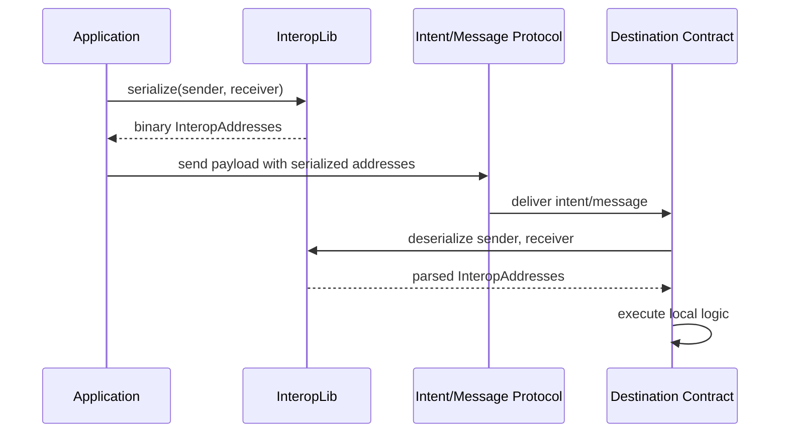
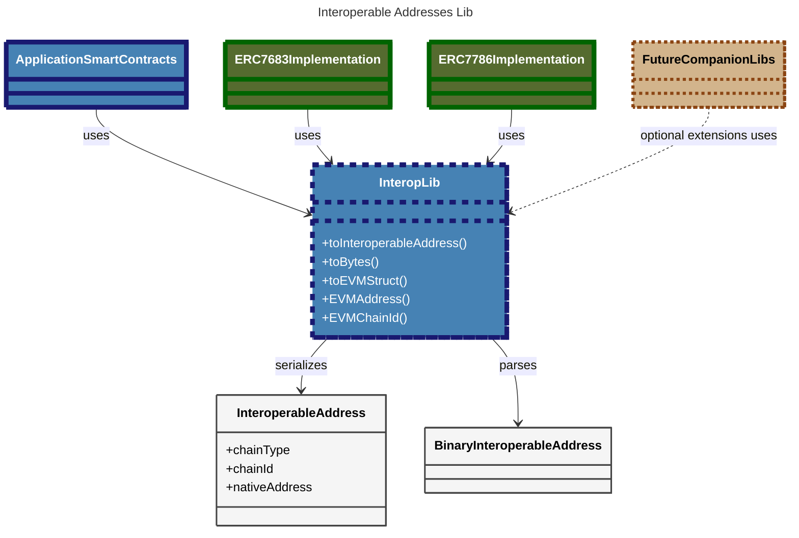

# Technical Specification: Solidity Library for Interoperable Addresses (ERC-7930)

# Background

[ERC-7930](https://ethereum-magicians.org/t/erc-7930-interoperable-addresses/23365) is a compact binary encoding standard for efficiently representing `(address, chain)` pairs as a singular identifier. It defines an *Interoperable Address* as a binary payload with the following fields:

- **Version**: Indicates how to parse the address and what information it may include.  
- **ChainType**: Specifies the CAIP namespace, grouping chains that share similar semantics.  
- **ChainId**: Identifies a specific chain within the family.  
- **Address**: Specifies the account on the given chain.

This standard is meant to be widely used in on-chain apps that need a compact and clear way to identify both chains and accounts. For example, [ERC-7683](https://eips.ethereum.org/EIPS/eip-7683) currently uses `bytes20` addresses with `uint256` chain IDs, and [ERC-7786](https://eips.ethereum.org/EIPS/eip-7786) relies on comparatively inefficient CAIP-10 string encoding.

To make integration easier, this document defines the specification of a Solidity library to convert between this format and regular `(address, chain ID)` pairs.

# General

This project provides a Solidity library to work with **Interoperable Addresses** as defined in [ERC-7930](https://ethereum-magicians.org/t/erc-7930-interoperable-addresses/23365).

### Example use cases

- **Account canonicity**: smart contracts could use it to reliably convert Interoperable Addresses to a uniform format and use them as keys in application-specific mappings.

- **Uniformity of addressing**: smart contracts could reliably extract canonical ‘native addresses’ from Interoperable Addresses and use them to track users across chains (e.g., to compute a user’s cross-chain aggregated balance in Everclear Chimera). This could be problematic when using CAIP-10 strings as in ERC-7786.

- **Communication between Application layer contracts and Intent Protocol**  
  An application creates an intent that will be filled and settled on a different chain. It uses the library to serialize the sender and receiver as Interoperable Addresses and include them in the intent payload.

- **Communication between Application layer contracts and Message Passing Protocol**  
  When sending a cross-chain message, the application encodes both the sender and the intended receiver using Interoperable Addresses. These are included in the message payload for use on the destination chain.

- **Communication between Protocol and Application layer contracts (Destination Chain)**  
  Upon receiving an intent or message, the destination-side contract deserializes the Interoperable Addresses to recover the sender or receiver identity and execute local logic accordingly.



All these cases rely on this library to avoid duplicating serialization and parsing logic. It enables developers to adopt Interoperable Addresses with minimal effort and no need to write custom code.

### Overview

- **Purpose**: Enable smart contracts to easily parse and serialize Interoperable Addresses by providing helpers for both `bytes` and `InteroperableAddress` types.

- **Motivation**:  
  - Interoperable Addresses are simple by design but do not fit directly into Solidity or ABI types. Without a library, developers would have to write custom code to encode and decode them, which adds friction and increases the chance of bugs.  
  - This library makes adoption easier. It lets developers use Interoperable Addresses without extra effort, helping them focus on their own applications instead of handling low-level details.  
  It is also meant to grow over time, with updates that follow the evolution of the standard. The goal is to reduce friction and support wider adoption in cross-chain protocols like ERC-7683 and ERC-7786, where accounts must be clearly and compactly identified across different chains.

### Requirements

- Serialize `(address, chain)` pairs into valid Interoperable Addresses for any chain type.
- Provide a simpler way to serialize EVM addresses into binary Interoperable Addresses without requiring the chain type explicitly.
- Parse the address, chain type, and chain ID from any valid Interoperable Address.
- Provide a simpler way to parse EVM addresses, returning just the address and chain ID.

### Scope

- **Included**:
  - Parsing Interoperable Addresses from their binary form into Solidity types.
  - Serializing from basic `(address, chain)` components into the Interoperable Address format.

- **Not included**:
  - Text-based representations of Interoperable Addresses.
  - Integration with ERC-7828.

- **Planned extensions**:
  - Support for future versions of the Interoperable Address format.
  - Companion libraries for converting to formats like [CAIP-2](https://github.com/ChainAgnostic/CAIPs/blob/cbee09d2885065ba15482398828d5c5e3ac57faa/CAIPs/caip-2.md) or [Everclear Chimera](https://docs.everclear.org/developers/getting-started) domain IDs, to improve compatibility with existing protocols.

# In-Depth

## Architecture

> 💡 The library will consist of a single Solidity file, designed to expose a clean and easy-to-use ABI, without introducing any additional architectural complexity.  
> It’s meant to be attached to struct types and bytes, so devs can use idiomatic constructs such as `addy.chainReference()` or `binaryPayload.toInteroperableAddress()`.



## Structs

The main purpose of the library is to convert the aforementioned `bytes` arrays into structs containing:

```solidity
struct InteroperableAddress {
    bytes2 chainType;
    bytes chainId;
    bytes nativeAddress;
}

struct EVMAddress {
    uint256 chainId;
    address addr;
}
```

## Enums

The library will **not** define enums for `ChainType` values. Solidity enums have two limitations:

1. They can become outdated as new `ChainType`s are registered.
2. Solidity 0.8.0 enums cannot represent all possible `bytes2` values.

> An alternative could be to use a user-defined value type wrapping `bytes2`, or define constants scoped to the library. These may be added later if there is demand from external parties.

## Interfaces

### **Base methods**

| Method                  | Input                                | Output                                                  | Description                                                   |
|-------------------------|--------------------------------------|----------------------------------------------------------|---------------------------------------------------------------|
| `toInteroperableAddress`| `(bytes binaryInteropAddress)`       | `(bool success, InteroperableAddress interopAddress)`    | Parses the full struct. Returns false if not possible.        |
| `toBytes`               | `(InteroperableAddress interopAddress)` | `(bytes binaryInteropAddress)`                        | Serializes the struct into ERC-7930 binary format.            |


### **Convenience methods**

| Method        | Input                          | Output                                     | Description                                                                 |
|---------------|--------------------------------|--------------------------------------------|-----------------------------------------------------------------------------|
| `toEVMStruct` | `(bytes binaryInteropAddress)` | `(bool success, EVMAddress evmAddress)`    | Parses into EVM-specific struct. Returns false on error.                   |
| `EVMAddress`  | `(bytes binaryInteropAddress)` | `(bool success, address evmAddress)`       | Extracts and returns the EVM address. Returns false if not possible.       |
| `EVMChainId`  | `(bytes binaryInteropAddress)` | `(bool success, uint256 chainId)`          | Extracts and converts the chain ID into a 256-bit uint. Returns false if not possible. |
| `toBytes`     | `(EVMAddress evmAddress)`      | `(bytes interopAddress)`                   | Serializes an EVM-specific struct into ERC-7930 binary format.             |


### **Low-level methods**

| Field           | Input                          | Output                                             | Description                                                   |
|------------------|--------------------------------|----------------------------------------------------|---------------------------------------------------------------|
| `chainType`     | `(bytes binaryInteropAddress)` | `(bool success, bytes2 chainType)`                 | Extracts the chain type. Returns false if not possible.       |
| `version`       | `(bytes binaryInteropAddress)` | `(bool success, bytes2 version)`                   | Extracts the version. Returns false if not possible.          |
| `chainId`       | `(bytes binaryInteropAddress)` | `(bool success, bytes chainId)`                    | Extracts the chain ID (raw bytes). Returns false if not possible. |
| `nativeAddress` | `(bytes binaryInteropAddress)` | `(bool success, bytes nativeAddress)`              | Extracts the address (raw bytes). Returns false if not possible. |


## **Usage examples**

### 1. Parse a full Interoperable Address

```solidity
using InteropLib for bytes;

// Example binary payload (ERC-7930 format)
bytes memory binaryInteropAddress = ;

// Attempt to parse the full InteroperableAddress struct
(bool success, InteroperableAddress memory interopAddress) = binaryInteropAddress.toInteroperableAddress();
require(success, "Invalid Interoperable Address");

// Access individual fields from the parsed struct
bytes2 chainType = interopAddress.chainType;            // e.g. 0x01 
bytes memory chainId = interopAddress.chainId;          // raw encoded chain ID
bytes memory rawAddress = interopAddress.nativeAddress; // raw encoded native address
```

### 2. Parse an EVM-compatible Interoperable Address

```solidity
using InteropLib for bytes;

// Decode payload into a simplified struct 
(bool success, EVMAddress memory evmAddress) = binaryInteropAddress.toEVMStruct();
require(success, 'Not EVM-compatible');

// Use the typed fields directly
address extracted = evmAddress.addr;        // native EVM address
uint256 chainId = evmAddress.chainId;       // native EVM chain ID 
```

### 3. Extract fields individually (without parsing full struct)

```solidity
using InteropLib for bytes;

// Extract only the EVM address
(bool success, address evmAddress) = binaryInteropAddress.EVMAddress();
require(success, "Failed to extract address");

// Extract only the EVM chain ID
(bool success, uint256 chainId) = binaryInteropAddress.EVMChainId();
require(success, "Failed to extract chainId");
```

### 4. Serialize a full Interoperable Address

```solidity
using InteropLib for InteroperableAddress;

// Manually construct an InteroperableAddress with raw data
InteroperableAddress memory interopAddr = InteroperableAddress({
    chainType: 0x01, 
    chainId: abi.encodePacked(1), // Encode the chain ID
    nativeAddress: abi.encodePacked(0xd8dA6BF26964aF9D7eEd9e03E53415D37aA96045) // Encode address
});

// Convert it to ERC-7930 binary format
bytes memory encoded = interopAddr.toBytes();
```

### 5. Serialize an EVM-specific struct

```solidity
using InteropLib for EVMAddress;

// Use a EVMAddress struct with typed fields
EVMAddress memory evmAddress = EVMAddress({
    addr: 0xd8dA6BF26964aF9D7eEd9e03E53415D37aA96045,
    chainId: 1
});

// Convert it to ERC-7930 binary format
bytes memory interoperableAddress = evmAddress.toBytes();
```

## Validation Rules

> 💡 The library will parse any addresses that are marked as compatible with the ERC-7930 v1 standard via the appropriate version bit, however it will only produce v1 InteroperableAddresses.

To keep the library maximally useful, low-level methods will attempt to extract values from InteroperableAddress without checking for the validity of the entire address (e.g. `.chainId()` may return successfully even if the payload is too short to be fully valid).

The convenience and base methods, however, will check validity of the entire Interoperable Address before returning.

## Error Handling

The library will not produce any reverts, since only internal calls will be performed to it, and users might not want the parsing errors to bubble up without a way to catch them easily within Solidity.

Instead, methods that can fail will return a boolean argument similar to low-level calls. This allows for a single call to both report errors and retrieve valid fields, saving gas.

In case there’s external feedback asking for methods producing errors, we could define a series of wrapper methods throwing the following custom errors.

| Error Name          | When it would be thrown                                                                 |
|---------------------|------------------------------------------------------------------------------------------|
| `UnsupportedVersion` | The version field denotes that the address cannot be parsed before attempting to do so. |
| `InvalidAddress`     | The formatting of the address itself is invalid (e.g. payload too short for given address/chainId lengths). |
| `NotEVMAddress`      | Thrown by convenience methods when address/chainId are not EVM.                         |

## Security Considerations

The main concern is that arbitrary `bytes` blobs not intended to be Interoperable Addresses might still parse correctly if they accidentally conform to the ERC-7930 format. This cannot be fully prevented without adding an on-chain checksum or signature.

However, the chances of such collisions are extremely low, especially since there are no widely used binary formats that resemble Interoperable Addresses. Adding a checksum would also **increase gas costs**, so the library deliberately avoids that tradeoff.

The parsing logic only inspects a fixed set of fields and does not allocate memory or perform complex computations, so there is no risk of gas griefing or denial-of-service via malformed input.

## Gas Optimization

- Parsing the full `InteroperableAddress` struct in a single call is more gas-efficient than extracting individual fields separately. This is because each field lookup is linear in the number of fields (`O(n)`), making multiple lookups more expensive.
- A benchmark should be added to compare the use of `bytes calldata` vs `bytes memory` as function inputs. Using `calldata` can reduce memory allocation costs in many cases and may be preferable for external or view functions.

## Testing Plan

### Hard requirements

- **Unit tests** for every method in the library
  - Must include both **fuzzed input** and **known valid addresses**.
  - Should cover both success and failure cases.
- **Medusa campaign**
  - While the library is stateless, Medusa may still be useful, as its fuzzing is coverage-guided and can find edge cases missed by Foundry.
  - Use a **low sequence length**, given that the library is stateless.

### Cool Testing Team Nerdsnipes

- Mutation testing campaign/CI step: good guinea pig for the methodology due to project simplicity.
- FFI-read of address list: for running against a larger list of examples.
- Differential testing with the Typescript SDK: will be borderline trivial if the SDK includes a companion CLI tool.

## External Requirements

- Feedback on ERC-7930 spec
- External feedback on the library’s ABI

> 🛠️ This library is designed as a shared utility to encourage consistent handling of interoperable accounts across the ecosystem. Contributions and feedback are welcome as the standard evolves.

> ⚠️ Please note that the design presented here serves as a foundational starting point. As the development process progresses, certain details may evolve and adjustments may be made. Therefore, the final implementation may differ from the initial design described in this document.
