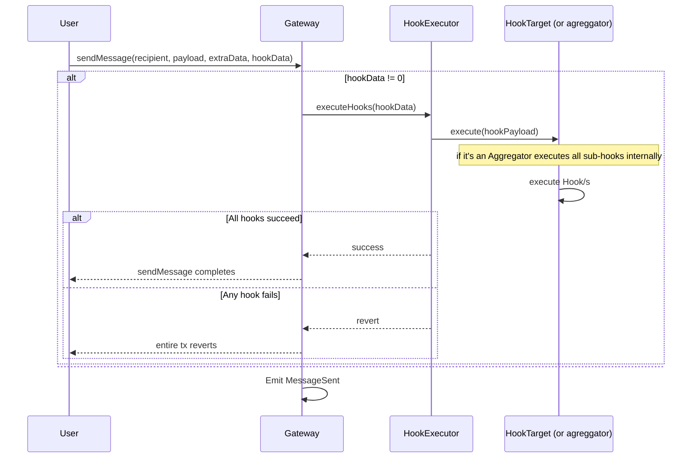

# HookExecutor: Failure Modes and Recovery Path Analysis

## Overview

This document analyzes failure modes related to the Hook execution using a `HookExecutor`, a smart contract responsible for executing post-processing hooks within a message-passing protocol. Hooks enable application-specific logic (e.g., validations, gas payments, set timeouts, store data, set time-locks) to run after a message is processed.

Design goals, anchored by ERC-7786:

1. **All-or-nothing delivery:** Either the message *and* every hook succeed, or the entire transaction reverts.
2. **Gateway isolation:** Hooks run in a separate execution context, so side effects can never corrupt gateway state.
3. **Caller responsibility:** The sender decides which hooks run, how much gas/value to forward, and bears the risk of misconfiguration.

This model generalizes a `CallExecutor` pattern, referencing a previously used pattern in some protocols, such as intents, where solvers submitted execution data for intents, and that logic was executed post-fill.

## Invariants

- Executor only calls external hooks via `.call()`
- Executor doesn’t hold internal state, funds or permissions.
- When the hook call fails, HookExecutor reverts as well.
- Hooks execute strictly in the order encoded in `hookData`.
- Value is forwarded unmodified.
- Bytecode at the executor address is immutable.
- A single entry point is one in which only one public function performs external calls.

### Hook Flow

## Contracts

| Contract | Responsibility |
| --- | --- |
| `Gateway` | Routes the message and call the `HookExecutor` |
| `HookExecutor` | Executes the post-processing hooks |
| `Hook Target` | To be called by the `HookExecutor`. It may be a dedicated hook or any existing contract with a function intended to be used as a hook. |

## Failure Modes and Recovery Paths

### FM1: Gateway executes the hook directly instead of calling through the HookExecutor

**Description:** If the Gateway were to call hooks directly, a malicious hook could exploit its context or cause unintended side effects.

**Risk Assessment:** High

**Impact:** High. Protocol corruption or unauthorized state changes.

**Likelihood:** Low. Design is explicit.

**Mitigation:** Gateway MUST always call to a `HookExecutor` and never call `hook.execute()` directly. To ensure consistency, the `HookExecutor` MUST stay as an immutable address in the Gateway storage. The `HookExecutor` code MUST be immutable. Audits must ensure this is not allowed. 

**Detection:** The protocol should track whether the call is made to the right contract. Check whether the `HookExecutor` address is what is expected, and the contract does not have a proxy or an address with a 7702 delegation.

**Recovery Path:** Deploy patched Gateway; deprecate faulty version.

---

### FM2: Hook fails silently, and the message is still sent

**Description:** If a failing hook doesn't revert, the message could be sent without all hooks executing correctly.

**Risk Assessment:** High

**Impact:** Low. Workflow completes without required hook logic.

**Likelihood:** High (spec requires revert on failure)

**Mitigation:** `HookExecutor` MUST propagate any non-success status and revert the entire transaction. Fuzz tests and functional tests MUST ensure that failures revert the transaction. There is not much the `HookExecutor` can do if the hook is wrongly targeted, for example, by providing a hook that doesn’t trigger anything.

**Detection:** User and off-chain actors interested in the underlying message should be attentive to the complete execution and implications.

**Recovery Path:** Message protocol MIGHT require not validating the message in the destination if it compromises its security. 

---

### FM3: Caller sets a malicious or incorrect hook

**Description:** The caller passes a `hookData` whose `hook` address is faulty, untrusted, or encodes an invalid aggregation tree (e.g., the aggregator recursively calls itself, or the sub-hook list is malformed). All such scenarios fall under the “incorrect hook definition” umbrella.

**Risk Assessment:** Medium

**Impact:** One or more of the following can occur:

- The entire `sendMessage` call reverts.
- Gas is consumed yet no functional hook logic executes.
- Other unexpected calls may include other kinds of malicious executions.

**Likelihood:** Medium to high (misconfiguration possible)

**Mitigation:** The caller must verify that the hook (or aggregator) code is trusted, correct, and acyclic. Off-chain static analysis and simulation tools SHOULD be used to lint aggregation trees before submission.

**Detection:** Transaction reverts with error data, or, if the hook succeeds, unintended on-chain side-effects visible in the hook’s storage/events.

**Recovery Path:** The revert ensures no message is processed. Responsibility lies entirely with the caller.

---

### FM4: Value Sent to Untrusted or Incorrect Hook

**Description:** The Caller sends a native value (`msg.value`) to a hook that misuses or traps it.

**Risk Assessment:** Medium

**Impact:** Medium. Value may be locked permanently.

**Likelihood:** Medium. Same assumptions as in FM3.

**Mitigation:** The caller should only forwards the value to trusted hooks.

**Detection:** Trapped balances in hook contracts without actual intended effects being completed (on-chain or off-chain).

**Recovery Path:** None. The caller bears the financial risk.

---

### FM5: Proper integration in the face of execution after transient state upgrade

**Description:** The `Gateway` will perform transient state updates before calling the `HookExecutor` contract. Integrating or related contracts need to be built with this in mind to disallow malicious users from exploiting the faulty paths. Imagine an integrating contract calls the Gateway to ensure the `sender` is not `address(0)` before executing an action. Now, because execution of the hook happens after the transient storage update, a malicious hook could call the vulnerable contract.

> 💡
> Summarizing: two states exist: when a message is being sent, and when a message is not being sent. When integrating contracts, one must know that they can be called in any of these states and handle them accordingly.   

**Risk Assessment:** 

**Impact:** Case by case, but the mismanagement of possible states can lead to high-severity issues.

**Likelihood:** Low. It may not be common for contracts to depend on these transiently updated variables to define paths, and contracts that depend on them should be aware of the different potential states. 

**Mitigation:** Be clear about the existence of this transient update so that no integrated or related contract mismanages it.

**Detection:** Depends on the effects caused on the hook call.

**Recovery Path:** None.

## Out of Scope

| Topic | Reason |
| --- | --- |
| Off-chain effects | Hooks may emit events, but external consumption is not in scope |
| Hook contract ownership or permissions | The protocol assumes hooks are correctly owned and authorized by the caller |
| Logic correctness or safety guarantees | The protocol provides **no guardrails** on hook behavior. Malicious or buggy hooks may revert, trap value, or misbehave |
| Gas estimation | The caller is fully responsible for providing enough gas for all hooks to complete |

---

## Action Items

Making use of hook executors requires:

- Document hook best practices for callers (safe value forwarding, interface compliance).
- Provide reference implementations for simple and aggregated hooks.

---

## Audit Requirements

- `HookExecutor.sol` and `Gateway.sol` must be audited. Gateway code should undergo review to ensure strict delegation and correct hookData handling.
- Reference hooks (escrow hook, gas payment hook, aggregator) should be tested and fuzzed.
