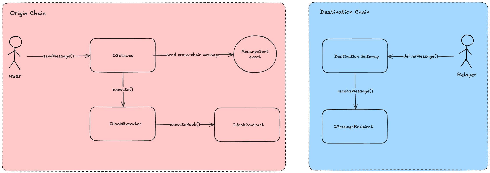

# Hooks Explainer

_To see the whole picture of the proposed changes for message passing standard, please refer [here](./message-passing-unified-specs.md)._

## What are Hooks?

**Hooks are extra actions that can run during the message flow.** They are composable and can change how things work without changing the messaging protocol.

The gateway/messenger invokes the hook after sending a message, passing only `(address hook, bytes payload)`. Because the call comes from the gateway, the hook can trust the context and, if needed, query the gateway for more details about the current message.

One valuable feature is that hooks can call other hooks, enabling *hook* action chaining. Also, hooks can be an aggregation of other hooks enabling, composition.

## Primary Use Case: Payment for relayers

When sending a cross-chain message, a relayer is typically required to deliver the message from the origin to the destination chain.

To incentivize relayers and guarantee delivery, it is often necessary to commit a fee payment (which is generally calculated from expected destination gas limit + relayer commercial fee) at the moment of sending the message.

For example by including the `hookData` field in `sendMessage`, in `Hyperlane`, users can atomically **pay the** `RelayerPaymentsContract` at the time of sending the message.

### Flow

- `hook` points to the relayers payment contract address.
- `hookData` encodes the call to pay the gas fee (`payForGas(messageId, gasAmount, refundAddress)`).
- `value` includes the ETH (or native token) payment amount.

### Example

Suppose the `RelayerPaymentsContract` exposes the function:

```solidity
function payForGas(bytes32 messageId, uint256 gasAmount, address refundAddress) 
  external payable;
```

The `hookData` passed to `sendMessage` would be:

```solidity
HookData({
  hook: address(RelayerPaymentsContract),
  hookPayload: abi.encodeCall(
    RelayerPaymentsContract.payForGas,
    (messageId, 300_000, userAddress)
  ),
  value: 0.02 ether
});
```

Thus, the flow would be:

- First, the cross-chain message is sent.
- Then, the hook is executed, paying the gas fee to the relayers’ payment contract.

### Benefits

- **Atomicity**: Gas payment and message sending happen in a single transaction.
- **Improved UX**: Users do not need to manually perform two transactions (pay + send).
- **Flexibility**: Gateways can support various gas payment systems without hardcoding them.
- **Optionality**: If no hook is provided, no gas prepayment occurs.


## Additional Use Cases for Hooks (Origin Chain)

Even beyond the relayer’s gas payment, `hookData` enables powerful extensibility in the origin chain:

### 1. Validation of Conditions

When sending a message, the hook could validate whether certain preconditions are satisfied (e.g., minimum balance checks, allowlist verifications).

If the validation fails, the transaction can revert immediately.

### 2. Bundling/Batching Multiple Messages

Hooks can package several cross-chain messages into an atomic bundle to treat them as one logical operation on the destination side. Each subsequent message references the previous one through a hook logic.

### 3. Notifying Other Contracts

The hook could inform or synchronize state with external systems (e.g., registering the outgoing message in an Message Manager contract).

### 4. Setting Up Timeout or Expiration Mechanisms

The hook can register a timeout or expiration condition associated with the message before dispatch.

**Example:**

- Before sending the message, the hook inserts the message ID and a timestamp into a `TimeoutManager` contract.
- Automated fallback logic can trigger if the message is not delivered or finalized within a certain timeframe (e.g., refunds, invalidations, retries).

**Why it matters:**

- Protects users against messages that could remain stuck indefinitely due to network failures, relayer issues, or malicious actors.
- Enables cleaner lifecycle management by ensuring stale or abandoned messages can be handled without manual intervention.

### 5. Callbacks-async execution

A message can easily specify via an async/callback-hook how to continue execution, e.g., in the case of a cross-chain read/view.


## General Benefits of `hookData`

- **Composable Execution**: Additional operations can be seamlessly combined with sending an intent.
- **Improved UX**: Users execute complex workflows atomically in one atomic call.
- **Future-Proof Design**: New use cases can be enabled without modifying the `sendMessage` core logic. Also the application layer can add business logic into the underlying messenger to be executed within the `sendMessage` call.
- **Optional by Nature**: Hooks are not mandatory — default behavior remains simple for users who do not require additional actions.
- Create dynamic instructions determined in runtime.

# Hook Execution Design

In order to ensure secure, controlled, and auditable execution of hooks, Gateways SHOULD delegate the hook execution to a dedicated `HookExecutor` contract instead of executing the hook directly.

## Rationale

- **Minimized Attack Surface**: The Gateway remains clean and focused on message dispatching only.
- **Centralized Security Checks**: Gas limits, address whitelisting, and value forwarding validations can be handled uniformly.
- **Future Upgradeability**: Execution models can evolve without changing the Gateway core logic.

## Proposed Model

- The `Gateway` validates the existence of `hookData`.
- The `Gateway` calls the `HookExecutor`, forwarding `hookData` and `msg.value` as needed.
- The `HookExecutor` executes the hook, ensuring that:
    - If the hook call fails, the transaction reverts.
    - Gas forwarding can be capped if necessary.



## Example: Minimal Hook Executor

```solidity
contract HookExecutor {
    function executeHook(IGateway.HookData calldata hookData) external payable {
        require(hookData.hook != address(0), "No hook address provided");

        (bool success, ) = 
               hookData.hook.call{value: hookData.value}(hookData.hookPayload);
        require(success, "Hook execution failed");
    }
}
```

- **Optional**: Implement `onlyGateway` access control to restrict who can trigger `executeHook`.

## Additional Notes

- Whether the hook is executed **pre-dispatch** or **post-dispatch** is left to the Gateway implementation. The interface itself remains agnostic.
- By default, hook failures **revert the entire transaction** to maintain safety and message atomicity.

## Comparison

| Aspect | Without Hooks | With Hooks |
| --- | --- | --- |
| **Extensibility (New Features)** | Hard to evolve; any new needs require gateway, or application contract upgrades. | New behaviors (e.g., payment models, service registrations) can be plugged via new hook contracts. |
| **Complexity at Gateway Level** | Gateway must implement all possible behaviors internally. | Gateway remains clean, delegating optional behaviors to external hook contracts. |
| **Transaction Atomicity** | Multi-step workflows require multiple user transactions. | Full workflows (fund, authorize, register) can happen atomically in one transaction. |
| **Optionality for Users** | Gateway has to generalize or restrict for all cases. | Hooks are purely optional; users choose to use them or not. |
| **Upgradability and Modularity** | Gateway becomes a bottleneck for protocol upgrades. | Hooks allow adding new features without touching the Gateway itself. |
| Payment for Relayers | Requires separate transactions or implicit integration in the Gateway. | Can be atomically prepaid at message dispatch time via a flexible, modular hook. |
| **Timeout and Expiration Handling** | Requires manual timeout systems or post-processing. | Can pre-register timeouts tied to message IDs, enabling automatic lifecycle management. |
| **Collateralization or Fund Locking** | Requires external pre-processing or off-chain coordination. Or a separated call after or before sending the message. | Funds can be locked atomically during the sendMessage flow through hooks. |

# Conclusion

Including `hookData` in the `sendMessage` interface unlocks atomic, modular, and future-proof workflows for cross-chain messaging, while keeping the core Gateway logic minimal, focused, and secure.

Hooks allow optional pre- and post-dispatch operations — such as fee prepayment, actor authorization, fund locking, or timeout registration — without forcing all users or messages to adopt the same processing flow.

By delegating auxiliary behaviors to external hook contracts, the protocol gains flexibility, extensibility, and safer upgrade paths, ensuring that evolving ecosystem needs can be supported without breaking core infrastructure.
