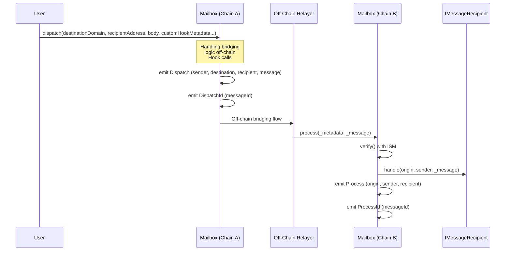
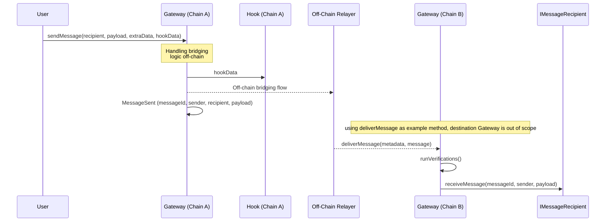

# Cross Messaging Unification

*This document aims to foster collaboration on existing standard specifications, without prescribing whether the best path forward involves evolving current ERCs or considering complementary directions.*

## Context

We propose a “unified” cross‑chain‑messaging interface that starts from ERC‑7786 and borrows useful ideas from ERC‑6170, ERC‑7854, and the Interop Working Group discussions.

The primary audience is application developers, who need a predictable, ergonomic API rather than a patchwork of bridge‑specific contracts.

This draft keeps 7786’s proven core but adds just enough opinionated structure—notably binary interoperable addresses and optional hooks—to make implementations consistent and developer‑friendly.

👉 **This unified version is open for discussion and collaboration, and we welcome feedback and contributions from the community.**

---

## Specification

A complete specification primarily consists of four logical building blocks:

1. **Gateway:** The canonical entry point API for the cross‑chain message flow. On the origin chain, it lets contracts send messages, emits a tracking event, and (optionally) invokes hook calls. On the destination chain, each implementation provides its own Destination Gateway, which is responsible for verifying the proof and delivering the message to the recipient.
2. **Recipient Interface**: A minimal contract API that must be implemented by any application wishing to receive messages.
3. Message: The envelope that travels cross‑chain: sender, recipient, payload, and extra data (implementation‑specific).
4. **Hooks**: Opt‑in extension points that let developers run arbitrary logic before or after the sending, without polluting the Gateway surface.

### Message Field Encoding

A cross-chain message consists of a is sender/recipient, payload, extra data and hooks.

### Sender and Recipient

Binary interoperable addresses (ERC‑XXXX), containing the account address and chain identifier (from CAIP‑2).

### Payload and Extra Data

The payload is an opaque `bytes` value. The Extra Data supplies any extra logic (e.g. low-level call) that developer wants to execute inside in the underlying message protocol logic.

### Hooks

A hook is any contract that should be executed around the core message sending. They make it possible for developers to include any external logic apart from the underlying message protocol entry point when sending a message. Hooks are encapsulated under a struct that contains the hook payload, and the address of the hook, which must be compliant with a binary representation of Interoperable Address and value. Hooks are never part of the message delivered to the recipient; they only affect the execution environment on the origin chain.

### Interfaces

Smart contracts interact with a `Gateway` to send and receive messages.Using hooks (`HookData`) is optional.

```solidity
interface IGateway {
  // Optional Hook data struct
  struct HookData {
	  bytes hookPayload;  // Low-level call within its parameters
 	  ILocalAddress hook; // Binary Interoperable Address
	  uint256 value;      // Optional, native token forwarded to the hook 
	  }
 
  event MessageSent(
    bytes32 outboxId,          // Unique ID (may be 0 if the gateway doesn’t track)
    bytes sender,              // Binary Interoperable Address
    bytes recipient,           // Binary Interoperable Address
    bytes payload,             // Message content
	  bytes calldata extraData,  // Gateway-specific hints, in some cases is not required
	  HookData calldata hookData // Optional Hook data
  );
  
  function sendMessage(
~~~~	  bytes calldata recipient,  // Binary Interoperable Address 
	  bytes calldata payload,    // Message content
	  bytes calldata extraData,  // Gateway‑specific parameters (may be empty)
	  HookData calldata hookData // Optional Hook definition
  ) external payable returns (bytes32 outboxId); // Unique ID (0 if unused)
}
```

The destination `IGateway` is out of scope in this specification. Its responsibility is to deliver the message to the recipient, which must implement the `IMessageRecipient` interface.

```solidity
interface IMessageRecipient {
	function receiveMessage(
	  bytes32 messageId, // Unique ID supplied by the destination gateway
    bytes sender,      // Binary Interoperable Address representation
    bytes payload      // Raw bytes of message content
	) external payable;
}
```

# Flows

A first glance on the existing and proposed flow.

## (As Reference) ERC-7786 flow:


## (As Reference) ERC-7854 flow:



## Proposed flow:

As well as above, this flow shows how it could work on top of the OP Stack message passing protocol.




## Rationale and Discussions

This design is an incremental alignment from what is best0 and evolve from ERC-7786 and other standards contributions.

**What stays the same**

- **Unchanged core API:** send and receive messages behave exactly as in ERC-7786. Adapters would remain the same way.
- **Safety / Liveness expectations**: All guarantees listed in ERC-7786 are inherited unchanged.
- Event-driven tracking: an `outboxId` is still emitted on the origin chain, and a `messageId` is returned on the destination chain.

**What is added**

- **Hooks (optional):** A  `HookData` struct lets a project plug in fee payment, logging, batched calls, callbacks or any other external logic without bloating the base call.
- **Future‑proof addressing:** Binary interoperable addresses (ERC-XXXX); 7786 plans to adopt the same format, so this is forward‑compatible.
- **Clear separation of concerns**: `extraData` tweaks behavior inside the gateway, while `HookData` runs code outside the gateway.

**Hooks vs. Attributes**

ERC-7786 introduces attributes (key/value blobs interpreted by the gateway). Hooks fill the same niche but with two advantages:

1. Arbitrary Logic: A hook is an external contract (often immutable) that runs any code the gateway’s `msg.sender` is authorized to execute. Developers are not limited to the selectors that the gateway happened to implement. So, They let developers import new selectors (functions) that the gateway never anticipated.
2. No bloat for minimal gateways: A bare-bones gateway doesn’t need to parse or store attribute blobs. If a project wants richer behavior, it can deploy its own hook contract.
3. Isolate risk: if a hook misbehaves, only that hook’s callers are affected, the core gateway remains simple and auditable.

`ExtraData` and `HookData`

- **`extraData`**: small blobs consumed *inside* the gateway (relevant for adapters e.g., define the gas limit or a caller).
- **`hookData`**: full contract calls executed *outside* the gateway (e.g., pay a relayer, emit custom analytics, trigger another bridge).

# Appendix

## High-level Delta

| **Change** | ERC-7786 | ERC-7854 | Unification | **Why?** |
| --- | --- | --- | --- | --- |
| **Renames** | `Gateway`, `sendMessage`, `executeMessage` | `Mailbox`, `dispatch`, `process`, `handle` | `Gateway`, `sendMessage`, `receiveMessage` | Fresh terminology around more common conventions. |
| **Message Struct** | No explicit struct. Parameters are passed directly: `destinationChain` (or `sourceChain`), `receiver` (or `sender`), `payload`, `attributes`. | Contains: `version`,  `nonce`,  `origin`,  `sender`,  `destination`, `recipient`, `body`. | No explicit struct. `Parameters` are passed directly: `sender` (or  `recipient`) `payload`, `extraData`, `HookData`, and `messageId` in destination. | Simpler surface; extra inputs stays in `extraData` or `HookData` instead of bloating the envelope. |
| **Chain identifier and addresses** | `string` based; follows CAIP rules. There is an intention to support binary representations and interoperable addresses. | Uses `uint32` and `bytes32` without defined standards. | Under development binary interoperable address, in `bytes`. | Chain-agnostic and accommodate the address efforts in the interop group. |
| Message identifiers | Gateway generates an `outboxId` in origin and `messageId` to be used in the destination. | Defined in the struct with `nonce`. | `outboxId` (origin event) and `messageId` (destination callback). | Leaves identifier format to the transport layer while giving explorers two stable anchors. |
| **Events** | Only `MessagePosted`. | Not defined in the standard. It's worth to add Hyperlane’s implementation introduces `Dispatch`, `DispatchId`, `ProcessId`, and `Process` events. | Defined as `MessageSent`  in the origin Gateway. | One standardised event makes indexing uniform and keeps the destination side stateless. |
| **Post sending messages / Hooks Declaration** | Under `attributes`, as an optional feature. | Part of `dispatch` as `calldata` with appointed interface. | Encapsulated under `Hookdata` struct, (`hook`, `hookPayload` and `value`). Executed outside the gateway. | Hooks give full flexibility without bloating the core API; gateways that don’t need them can ignore the field. |
| Verification step | Abstracted from the interface. | Defined as an ISM. | Abstracted from the interface. | Keeps this ERC small; verification frameworks evolve quickly and deserve their own track. |
